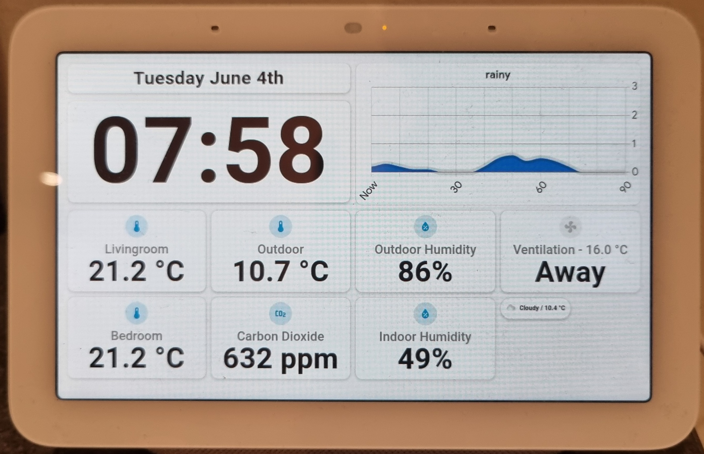

## Dashboard on Nest Hub

This document describes how I created a smart home dashboard with good visibility around the room, that can be shown on a Google Nest Hub.
The first image is a photo of the hub as it looks in the kitchen, the second is a screenshot of the dashboard from a web browser.





Previously I have used the custom button-card for lovelace (https://github.com/custom-cards/button-card), but recently I experimented with the custom mushroom cards (https://github.com/piitaya/lovelace-mushroom) and liked the simple approach, requiring very little customization to achieve the look that I was after.

The dashboard uses primarily mushroom cards and the custom grid-layout from lovelace-layout-card (https://github.com/thomasloven/lovelace-layout-card).

# Pre-requisite

To make a dashboard like mine you will need to install:

 - [Mushroom](https://github.com/piitaya/lovelace-mushroom)
 - [Lovelace-layout-card](https://github.com/thomasloven/lovelace-layout-card)
 - [card-mod](https://github.com/thomasloven/lovelace-card-mod)

Follow the instructions for installing each package on your own installation.

# The Layout

For details of my layout and how it is implemented, see the file [nest_hub.yaml](nest_hub.yaml). This is the full export of the code for the entire dashboard. 
You should be able to create a new dashboard in 
your Home Assistant instance and paste some or all of this file into your own configuration:

The rest of this document describes how to achieve the layout and the individual sensor cards.

## Grid view
The dashboard uses the grid layout card. There was a problem displaying a grid layout directly on the nest hub so I first created a dashboard with a grid view, and then inserted a grid-layout card inside that. This then works and displays as you see in the images above.

The ```yaml``` code shown below is the first part of the configuration. You can see that first the grid-layout is defined for the view, the ```path```, and the ```title```. You will also see that a custom ```theme``` is defined. More on that in the next sectoin. Next, in the ```cards``` specification, a ```custom:layout-card``` is defined. This is our main container for the dashboard.
The ```layout```specifies 4 columns each taking a quarter of the width. We use 4 columns for the individual sensor cards, and merge into 2 columns for the date, clock and weather displays.

```yaml
views:
  - type: custom:grid-layout
    path: nest-dashboard
    theme: mush_nest_panel
    title: Nest
    cards:
      - type: custom:layout-card
        layout_type: custom:grid-layout
        layout:
          grid-template-columns: repeat(4, 1fr)
          grid-template-rows: auto auto auto auto
          grid-template-areas: |
            "datearea  datearea   weather  weather" 
            "timearea  timearea   weather  weather"  
            "button1   button2    button3  fan" 
            "button4   button5    button6  chips "
```

## Custom theme

Mushroom cards allow for some degree of customization using a custom theme. To achieve what I wanted I have tweaked a copy of the baseline theme to 
have larger fonts. The larger fonts will not work in all situations, and are designed to be used with my bespoke layout.

You can obtaine a copy of the baseline [mushroom theme at this location](https://github.com/piitaya/lovelace-mushroom-themes). Follow the instructions 
to install this or modify them to fit your own needs. It is important to give the theme a name that is unique so if you create more than one mushroom 
theme, be sure to give them different names.

In my tweaked theme I have changed the following to get the large font look that I was after:

```yaml
    masonry-view-card-margin: 4px 4px 4px 4px

    # Card
    mush-card-primary-font-size: 22px
    mush-card-secondary-font-size: 50px
    mush-card-primary-font-weight: 500
    mush-card-secondary-font-weight: 600
    mush-card-primary-line-height: 25px
    mush-card-secondary-line-height: 52px
    mush-card-primary-color: grey

    mush-card-border-radius: 18px

```

Download [Custom theme](https://github.com/jm-cook/my-smart-home/blob/main/nest-hub-dashboard/mush_nest_panel_theme.yaml)


## Date card

To achieve the date card like mine, you have to do a little bit of work. You will make use of the [time_date platform](https://www.home-assistant.io/integrations/time_date/). You can add this as an integration using the "Add integration" button. For the Date and Time cards in this dashboard you will need to add both the _date_ and _time_ sensors. Using these sensors we can create additional helpers.

For the date card, create a new template helper with Device class "Date" in the helpers section of settings. The state template I used is:

```jinja2

{% set datetime = strptime(date, '%Y-%m-%d') %}
{% set weekday = datetime.strftime('%A') %}
{% set month = datetime.strftime('%B') %}
{% set day = datetime.strftime('%d') | int %}
{%
  set suffix = 'st' if (day % 10 == 1 and day != 11)
  else 'nd' if (day % 10 == 2 and day != 12)
  else 'rd' if (day % 10 == 3 and day != 13)
  else 'th'
%}
{{ weekday }} {{ month }} {{ day }}{{ suffix }}
```

It seems easiest to do this in yaml as the helper dialog wouldnt accept a multiline template like the one above.

You should add the following _yaml_ to your ```configuration.yaml```:

```yaml
template:
  - sensor:
      - name: current_date
        icon: mdi:calendar-today
        unique_id: current_date_formatted
        state: >-
          
          {% set datetime = strptime(date, '%Y-%m-%d') %}
          {% set weekday = datetime.strftime('%A') %}
          {% set month = datetime.strftime('%B') %}
          {% set day = datetime.strftime('%d') | int %}
          {%
            set suffix = 'st' if (day % 10 == 1 and day != 11)
            else 'nd' if (day % 10 == 2 and day != 12)
            else 'rd' if (day % 10 == 3 and day != 13)
            else 'th'
          %}
          {{ weekday }} {{ month }} {{ day }}{{ suffix }}
```

The Date card itself is simply a mushroom entity card. You can create it in the editor for mushroom cards, but here is the full yaml configuration for my card:

```yaml
          - type: custom:mushroom-entity-card
            entity: sensor.current_date
            layout: vertical
            primary_info: none
            icon_type: none
            secondary_info: state
            hold_action:
              action: none
            double_tap_action:
              action: none
            tap_action:
              action: none
            card_mod:
              style:
                mushroom-state-info$: |
                  .container {
                     --card-secondary-font-size: 2em;
                     --card-secondary-line-height: 1.1em;
                     --card-primary-font-size: 20px;
                     align-items: center;
                  }
            view_layout:
              grid-area: datearea
```

Here we have had to tweak the font sizes a little (it is the seconary_info field that we are using) in order to get a nice readable display, so I used card_mod for that. Note this overrides the already adjusted font size in the custom theme. This seems to be a size that fits for most situations.

## Time card

The time card is simpler than the date card and can use the time sensor without further formatting. You need to create a helper, I did mine in the main configuration file (obviously combine this with the date definition from the previous section):


Yaml for the time card also overrides the font size:

```yaml
          - type: custom:mushroom-entity-card
            entity: sensor.time
            layout: vertical
            primary_info: none
            icon_type: none
            secondary_info: state
            hold_action:
              action: none
            double_tap_action:
              action: none
            tap_action:
              action: none
            card_mod:
              style:
                mushroom-state-info$: |
                  .container {
                     --card-secondary-font-size: 160px;
                     --card-secondary-line-height: 160px;
                     --card-primary-font-size: 10px;
                     align-items: center;
                  }
            view_layout:
              grid-area: timearea
```

## Nowcast (weather) card

## Sensor cards

## Flexit balanced air circulation card

## Weather chip
