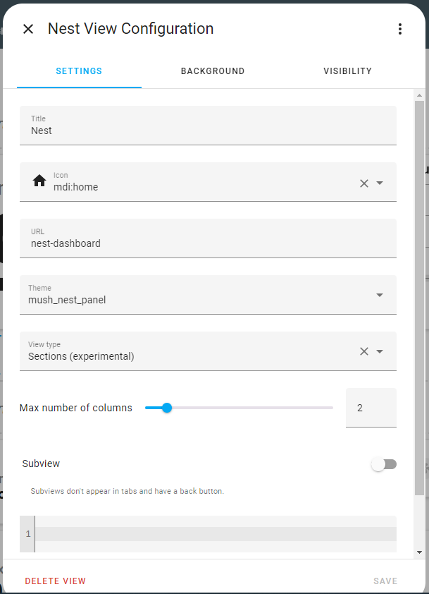

## Dashboard on Nest Hub

This document describes how I created a smart home dashboard that can be shown on a Google Nest Hub and with good visibility around the room,.
The first image is a photo of the hub as it looks in the kitchen, the second is a screenshot of the dashboard from a web browser.


</br>


Previously I have used the custom button-card for lovelace (https://github.com/custom-cards/button-card), but recently I experimented with the custom mushroom cards (https://github.com/piitaya/lovelace-mushroom) and liked the simple approach, requiring very little customization to achieve the look that I was after. 
I was able to remove approximately 350 lines of tricky template configuration code in every dashboard
where my button-cards were used and I am quite happy with the result.

The dashboard uses primarily mushroom cards and the custom grid-layout from lovelace-layout-card (https://github.com/thomasloven/lovelace-layout-card).
I previously made some minor custom adjustments using ```card_mod```, but these have now been removed as they did not work reliably when casting.

# Pre-requisite

To make a dashboard like mine you will need to install:

 - [Mushroom](https://github.com/piitaya/lovelace-mushroom)
 - [Lovelace-layout-card](https://github.com/thomasloven/lovelace-layout-card)
 - [card-mod](https://github.com/thomasloven/lovelace-card-mod)

Follow the instructions for installing each package on your own installation.

Additional downloads are required for the weather card described later on.

# The Layout

For details of my layout and how it is implemented, see the file [nest_hub.yaml](nest_hub.yaml). This is the full export of the code for the entire dashboard. 
You should be able to create a new dashboard in 
your Home Assistant instance and paste some or all of this file into your own configuration:

The rest of this document describes how to achieve the layout and the individual sensor cards.

## Sections view
The dashboard uses the ```sections``` view. Other views such as ```panel``` with a grid inside had issues where not all style settings would be honoured.

The ```yaml``` code shown below is the first part of the configuration (it's incomplete and just for illustration). You can see that first the sections type is defined for the view, the ```path```, and the ```title```. You will also see that a custom ```theme``` is defined. More on that in the next section. The specification then continues to define the various sections. If you use the UI to create your sections view then a configuration like this will be created for you.

```yaml
views:
  - type: sections
    max_columns: 2
    theme: mush_nest_panel
    cards: []
    title: Nest
    path: nest-dashboard
    icon: mdi:home
    sections:
      - type: grid
        cards:
```

The screenshot below is the popup for creating the dashboard described here:



## Custom theme

Mushroom cards allow for some degree of customization using a custom theme. To achieve what I wanted I have tweaked a copy of the baseline theme to 
have larger fonts. The larger fonts will not work in all situations, and are designed to be used with my bespoke layout.

You can obtain a copy of the baseline [mushroom theme at this location](https://github.com/piitaya/lovelace-mushroom-themes). Follow the instructions 
to install this or modify them to fit your own needs. It is important to give the theme a name that is unique so if you create more than one mushroom 
theme, be sure to give them different names.

In my tweaked theme I have changed the following to get the large font look that I was after:

```yaml
    # Card
    mush-card-primary-font-size: 130%
    mush-card-secondary-font-size: 300%
    mush-card-primary-font-weight: 500
    mush-card-secondary-font-weight: 900
    mush-card-primary-line-height: 110%
    mush-card-secondary-line-height: 110%
    mush-card-primary-color: grey
    mush-card-border-radius: 18px
    # Chip
    mush-chip-border-radius: 25px
    mush-chip-font-size: 0.5em
    mush-chip-font-weight: bold
    mush-chip-icon-size: 0.5em
    # Icon
    mush-icon-size: 30px
```
Some of the style elements for chips are also tweaked for readability on a room display, and the icon size was adjusted so that the mushroom card would fit nicely with a larger font in the new gridded sections view..

I also changed a couple of spacings for the sections view because I thought it looked slightly better on the small nest display. These settings also seemed to work well on a mobile phone.

```yaml
    ha-card-box-shadow: 0px 2px 4px 0px rgba(0,0,0,0.16)
    ha-card-border-radius: 16px !important
    ha-view-sections-column-gap: 8px
    ha-view-sections-row-gap: var(--ha-view-sections-column-gap)
```

Download my [custom theme](https://github.com/jm-cook/my-smart-home/blob/main/nest-hub-dashboard/mush_nest_panel_theme.yaml) for the full list of customizations that I have used.


## Date and time card

To achieve the date card like mine, you have to do a little bit of work. You will make use of the [time_date platform](https://www.home-assistant.io/integrations/time_date/). You can add this as an integration using the "Add integration" button. For the Date and Time cards in this dashboard you will need to add both the _date_ and _time_ sensors. Using these sensors we can create additional helpers.


For the date and time card, create a new template helper with Device class "Date" in the helpers section of settings. The state template I used is:

```jinja2

{% set datetime = strptime(date, '%Y-%m-%d') %}
{% set weekday = datetime.strftime('%A') %}
{% set month = datetime.strftime('%B') %}
{% set day = datetime.strftime('%d') | int %}
{%
  set suffix = 'st' if (day % 10 == 1 and day != 11)
  else 'nd' if (day % 10 == 2 and day != 12)
  else 'rd' if (day % 10 == 3 and day != 13)
  else 'th'
%}
{{ weekday }} {{ month }} {{ day }}{{ suffix }}
```

It seems easiest to do this in yaml as the helper dialog wouldn't work with a multiline template like the one above.

You should add the following _yaml_ to your ```configuration.yaml```:

```yaml
template:
  - sensor:
      - name: current_date
        icon: mdi:calendar-today
        unique_id: current_date_formatted
        state: >-
          
          {% set datetime = strptime(date, '%Y-%m-%d') %}
          {% set weekday = datetime.strftime('%A') %}
          {% set month = datetime.strftime('%B') %}
          {% set day = datetime.strftime('%d') | int %}
          {%
            set suffix = 'st' if (day % 10 == 1 and day != 11)
            else 'nd' if (day % 10 == 2 and day != 12)
            else 'rd' if (day % 10 == 3 and day != 13)
            else 'th'
          %}
          {{ weekday }} {{ month }} {{ day }}{{ suffix }}
```

The Date card with time display is a built-in ``picture-elements`` card with a blank image. This might seem slightly strange, the reason for using this is because it has options to set the style directly, rather than going the ``card_mod`` route. This gives good control over the font sizes and works well on the nest display when casted. Note that I also added a media query so that the big clock is not shown when viewing on a mobile phone.

```yaml
type: picture-elements
image: https://fakeimg.pl/400x200/ffffff,0/000/?text=%20
elements:
  - type: state-label
    entity: sensor.time
    style:
      left: 50%
      top: 60%
      font-size: 1100%
      font-weight: 550
  - type: state-label
    entity: sensor.current_date
    style:
      left: 50%
      top: 20%
      font-size: 200%
      font-weight: 500
      color: grey
visibility:
  - condition: screen
    media_query: '(min-width: 768px)'
layout_options:
  grid_columns: 4
  grid_rows: 4
```


The example uses the ``picture-elements`` card but this will also work with a mushroom template card displaying both the time and the date but I had trouble with the ``card_mod`` settings not working well on a nest display. You can create it in the editor for mushroom cards, but here is the full yaml configuration for my card:

```yaml
          - type: custom:mushroom-template-card
            primary: '{{states(''sensor.current_date'')}}'
            secondary: '{{states(''sensor.time'')}}'
            icon: ''
            tap_action:
              action: none
            hold_action:
              action: none
            double_tap_action:
              action: none
            entity: sensor.time
            fill_container: true
            card_mod:
              style:
                mushroom-card:
                  mushroom-state-item:
                    mushroom-state-info $: |
                      .container {
                         --card-secondary-font-size: 160px;
                         --card-secondary-line-height: 175px;
                         --card-primary-line-height: 40px;
                         --card-primary-font-size: 30px;
                         align-items: center;
                      }
            view_layout:
              grid-area: timedate
```

Here we have had to tweak the font sizes a little in order to get a nice readable display, so I used card_mod for that. Note this overrides the already adjusted font size in the custom theme. This seems to be a size that fits for most situations. As I said, I am not using this solution anymore as it doesn't always display with the correct font sized on a casted display-


## Nowcast (weather) card


The weather card is made up of a [custom chartjs-card](https://github.com/plckr/chartjs-card) to show a graph
of the predicted rainfall in the immediate future (every 5 minutes next 90 minutes) - so called "nowcast". The Norwegian Met office provide nowcast data for locations
in Norway and it can be retrieved through a [custom integration](https://github.com/toringer/home-assistant-metnowcast).

If you want a card like mine then first install the nowcast integration and configure it for your location. You then need 
to get the forecast information into a suitable form for displaying the graph. There are a couple of ways to achieve this but I made a new trgger template sensor 
to update every 5 minutes as follows:

```yaml
template:
  - trigger:
      - platform: time_pattern
        minutes: /5
    action:
      - service: weather.get_forecasts
        target:
          entity_id: weather.met_no_nowcast_myplace
        data:
          type: hourly
        response_variable: nowcast_5min
    sensor:
      - name: nowcast
        unique_id: weather_nowcast
        state: "{{ (state_attr('weather.met_no_nowcast_myplace', 'forecast_json') | from_json)[0].condition }}"
        attributes:
          forecast: >
            {{ nowcast_5min['weather.met_no_nowcast_myplace'].forecast  }}

```

This results in a sensor with a forecast attribute that can be used in the graph.

This card requires some custom javascript code to be included in the configuration and my solution is as follows:

```yaml
          - type: custom:chartjs-card
            chart: line
            data:
              datasets:
                - backgroundColor: rgb(65,105,225)
                  borderWidth: 10
                  fill: true
                  cubicInterpolationMode: monotone
                  data: >-
                    ${states['sensor.nowcast'].attributes.forecast.map(fcast =>
                    ({x: (new Date(fcast.datetime).getTime()-new
                    Date().getTime()), y: parseFloat(fcast.precipitation)}))}
              blabels: ${30}
              labels: >-
                ${states['sensor.nowcast'].attributes.forecast.map(fcast =>
                5*Math.floor((new Date(fcast.datetime).getTime()-new
                Date().getTime())/(5000*60)))}
            entity_row: true
            custom_options:
              showLegend: false
            options:
              elements:
                point:
                  radius: 0
              scales:
                x:
                  max: 90
                  min: 0
                  display: true
                  color: red
                  ticks:
                    callback: >-
                      ${(function (val, index) {   var lval =
                      parseInt(this.getLabelForValue(val));  if (lval == 0) {
                      return 'Now';} else { return  lval % 30 === 0?lval:'';}  
                      })}
                    font:
                      size: 18
                'y':
                  beginAtZero: true
                  display: true
                  position: right
                  grid:
                    color: >-
                      ${(function(context) {return context.tick.value%1
                      ===0?'#aaaaaa':'#000000';})}
                  ticks:
                    callback: >-
                      ${(function(val, index) { var lval =
                      this.getLabelForValue(val); var ival = Math.round(lval);
                      return lval % 1 === 0 ? ival : '';})}
                    font:
                      size: 18
                  max: 3
              plugins:
                title:
                  display: true
                  font:
                    size: 18
                  text: ${states['sensor.nowcast'].state;}
            view_layout:
              grid-area: weather
```

A simpler solution could also be used but I wanted to add some embellishments such as ticks and axis labels.

## Sensor cards


The sensor cards are all pretty much the same and show 6 of the sensors, the ones that I am mainly interested in, temperature, humidity and CO2.
The sensor cards are straight forward mushroom cards using the theme described previously. The larger fonts make the display more readable when it is on the counter or wall mounted.

Each of the sensor cards specifies a different entity. The vertical mushroom layout is used (then it looks a bit like my original button card format), and the grid-area needs to be specified correctly referring to the grid-layout.


The first card looks like this, the rest are similar.

```yaml
type: custom:mushroom-entity-card
entity: sensor.indoor_temperature
name: Livingroom
fill_container: true
layout_options:
  grid_rows: 2
  grid_columns: 2
layout: vertical
```

The detault tap action is used, so if you click on a sensor, it will show a graph of recent values.

## Flexit balanced air circulation card


Our home has installed a balanced air system for air circulation. This keeps the air fresh and is energy efficient. The system can be accessed using the 
[Flexit Nordic](https://www.home-assistant.io/integrations/flexit_bacnet/) integration. This is an integration for newer models where network 
access is built in to the device. The integration provides a climate device with sensors and controls.

The Mushroom climate card was not really suitable for what I wanted for my display so I used the Mushroom template card to achieve a 
simple clear display, with the setpoint, and ```preset_mode``` in focus. Control is possible by clicking on the card. The icon colour will change according to the ```preset_mode```

```yaml
type: custom:mushroom-template-card
primary: Ventilation - {{ state_attr('climate.flexit_nordic', 'temperature') }} °C
secondary: |
  {{ state_attr('climate.flexit_nordic', 'preset_mode' ).capitalize() }}
icon: mdi:fan
icon_color: |-
   
    var(--rgb-state-climate-heat-cool)
   
    var(--rgb-state-climate-heat)
  
    var(--rgb-state-climate-idle)
  
layout: vertical
entity: climate.flexit_nordic
tap_action:
  action: more-info
view_layout:
  grid-area: fan
```

## Weather chip


The remaining grid area can be used for an additional sensor, or as I have chosen, to add further information in the form of 
mushroom _chips_. So far I have added a weather chip, and clicking on this will show the forecast for the next hours/days.

```yaml
type: custom:mushroom-chips-card
chips:
  - type: weather
    entity: weather.forecast_home
    show_conditions: true
    show_temperature: true
view_layout:
  grid-area: chips
```

# Casting to the nest hub

Casting to the nest hub is not covered in detail here, you should search for the blueprint solution elsewhere for a persistent solution. I used the ``kind3r/cast-and-re-cast-a-lovelace-view-to-a-google-hub.yaml`` blueprint.
If you just want to try out
casting your own dashboard to a nest hub, navigate to your cast device *Settings->Integrations->Google cast*. Then look for your device in the devices list.
From there you can navigate to "browse media", and find your dashboard. Then click the "play" button.

# Challenges and workarounds

Note that when using the grid-layout, it is necessary to have this inside a panel dashboard - otherwise display on a nest hub will not work. Some other workarounds are also needed and for this reason I have gone away from using the custom ``grid-layout`` and now use the built-in sections view.
