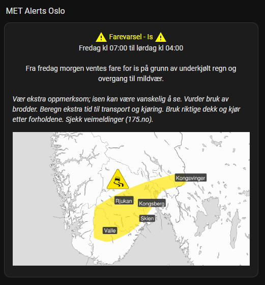

```yaml
sensor:
  - platform: met_alerts
    name: MET Alerts Oslo
    latitude: 59.951071
    longitude: 10.673786
```

```jinja2

 

 

{%-   set start_timestamp = as_timestamp(strptime(start_time, "%Y-%m-%dT%H:%M:%S%z")) %}
{%-   set end_timestamp = as_timestamp(strptime(end_time, "%Y-%m-%dT%H:%M:%S%z")) %}
{%-   set start_day_index = start_timestamp | timestamp_custom("%w") | int %}
{%-   set end_day_index = end_timestamp | timestamp_custom("%w") | int %}



{%-     set met_alerts_time = start_day + ' kl ' + (start_timestamp | timestamp_custom("%H:%M")) + ' til ' + (end_timestamp | timestamp_custom("%H:%M")) %}

{%-     set met_alerts_time = start_day + ' kl ' + (start_timestamp | timestamp_custom("%H:%M")) + ' til ' + end_day + ' kl ' + (end_timestamp | timestamp_custom("%H:%M")) %}




        <center><font color="{{ state_attr(snsr, 'awareness_level_color') }}"><ha-icon icon="mdi:alert"></ha-icon> Farevarsel - {{ state_attr(snsr, 'event_awareness_name') }} <ha-icon icon="mdi:alert"></ha-icon></font></center>
        <center>{{ met_alerts_time }}</br></br>
        {{ state_attr(snsr, 'description') }}</center>
        </br>
        <i>{{ state_attr(snsr, 'instruction') }}</i>
        
 }})


{{none}}


```

```jinja2

{{ met_alerts_view('sensor.met_alerts_oslo') }}
```


